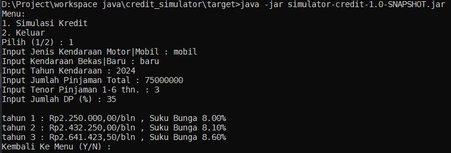

### how to build project
for build project, type this command :

	> mvn clean install
### how run *.jar file
after build this project, target folder is generated automatic, for run try this program, go to inner target folder then run :

	> ./java -jar simulator-credit-1.0-SNAPSHOT.jar

### how run *.jar file with file_inputs.txt
for run this program with parameter, run this command :

	> java -jar simulator-credit-1.0-SNAPSHOT.jar ../file_inputs.txt
